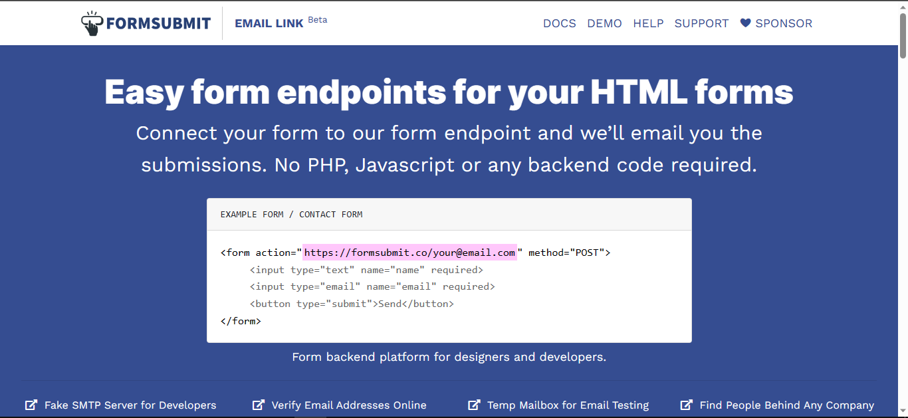
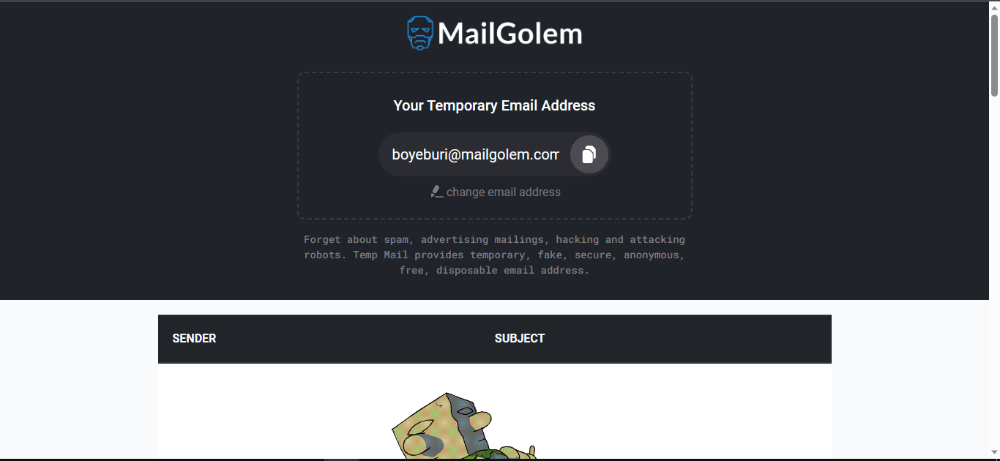
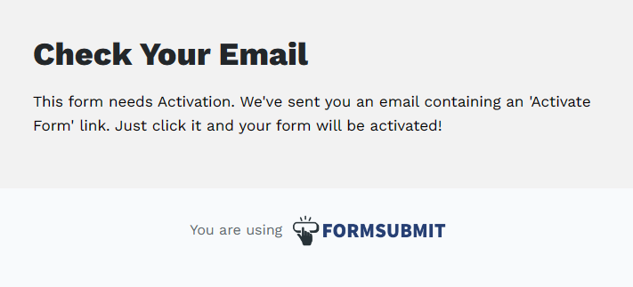
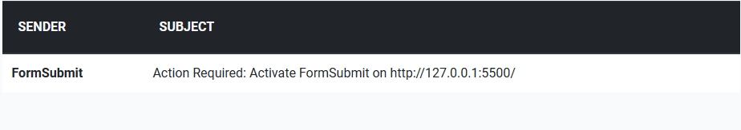
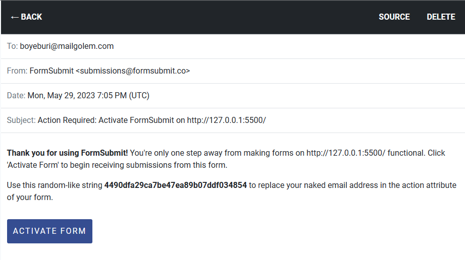
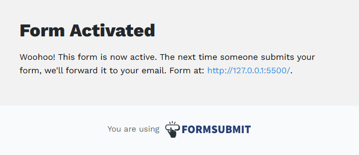
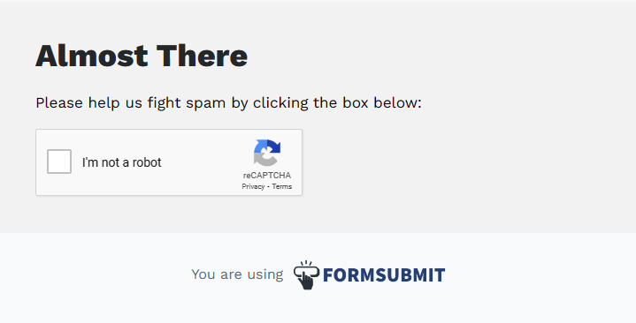
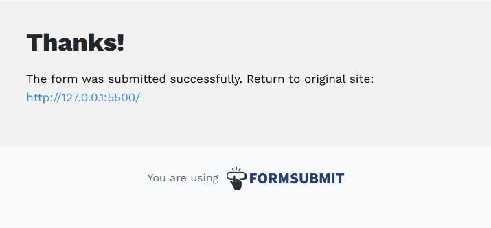
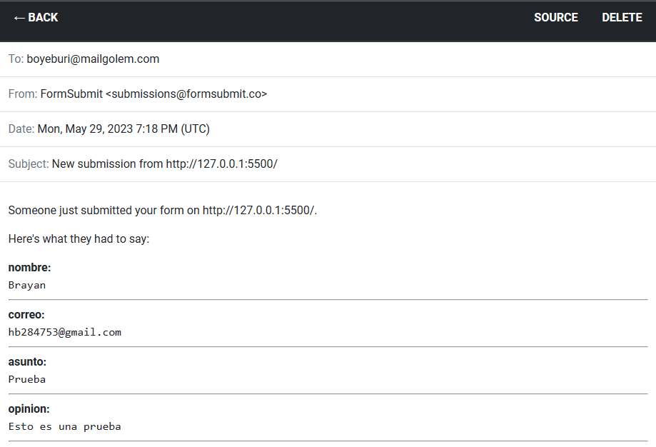

# Formulario de contacto 

Este formulario esta echo con algo de html y css basico, ademas de que se hace de uso de Formsubmit que nos permite enviar correos sin la necesidad de crear un backend, se puede utilizar de diferentes formas, siendo la mas simple agregando una url especial dentro de la etiqueta action, toda la documentacion y uso estan es su pagina que es la siguiente [Formsubmit](https://formsubmit.co/).


<br><br>

Para no compremeter nuestro correo personal y para pruebas utilizaremos mailgolem, este nos proporciona un correo falso, funcional y temporal con este podremos recivir todos los correos del formulario su uso es muy sencillo y toda la informacion se encuentra en su pagina que es la siguiente [mailgolem](https://mailgolem.com/).


<br><br>

## Utilizaremos un correo para tomarlo de ejemplo y probarlo

1. Primero tomaremos el correo que nos proporciona mailgolem.

2. Despues lo colocaremos en la propiedad action de la etiqueta form.

```html
 <form class="form-register" id="contacto" action="https://formsubmit.co/boyeburi@mailgolem.com" method="post">
    <h4><bold>Formulario</bold> de contacto</h4>
    <input class="controls" type="text" name="nombre" id="nombre" placeholder="Ingrese su nombre" required>
    <input class="controls" type="email" name="correo" id="correo" placeholder="Ingrese su correo" required>
    <input class="controls" type="text" name="asunto" id="asunto" placeholder="Asunto" required>
    <textarea class="controls" name="opinion" id="opinion" placeholder="Danos tu opinion" row="4" required></textarea>
    <input class="botton" id="enviar" type="submit" value="Enviar">
    <p>Gracias por tus opiniones <a href="">regresar</a></p>
  </form>

```

3. Una vez colocado tendremos que hacer una prueba para que el formulario se valide.


<br><br>

4. Tendremos que revisar en nuestra bandeja de mailgolem para darle permisos al formulario y validarlo.


<br><br>

5. Ahora le daremos permiso al formulario.


<br><br>

7. Despues de darle los permisos nos aparecera lo siguiente y podra regresarnos a nuestro formulario.


<br><br>

8. Una ves que se le dio permiso al fomrulario podra funcionar de manera correcta por lo que podremos hacer pruebas, una ves llenando los campos, tendremos que hacer un recaptcha, una vez realizado el recaptcha, nos regresara a nuestro formmulario.


<br><br>


<br><br>

7. Ahora podremos revisar nuestra bandeja de mailgolem para revisar los datos que se han enviado.


<br><br>